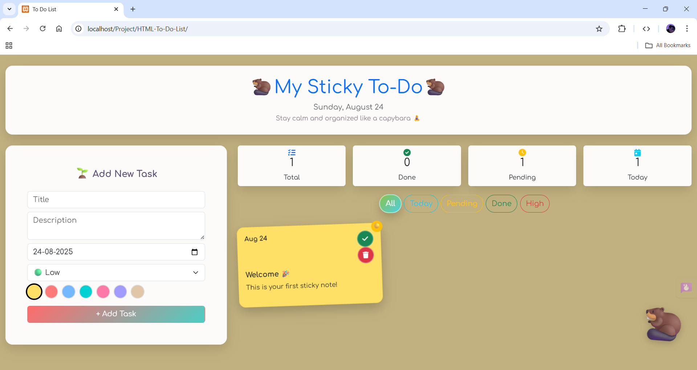
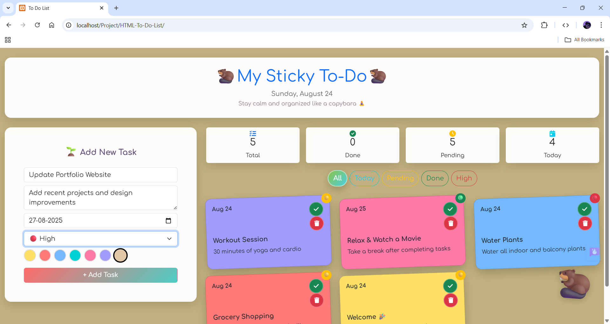
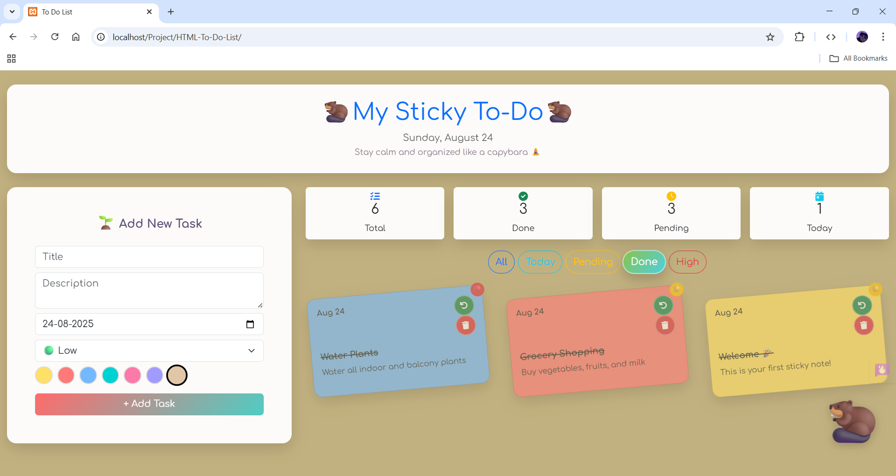
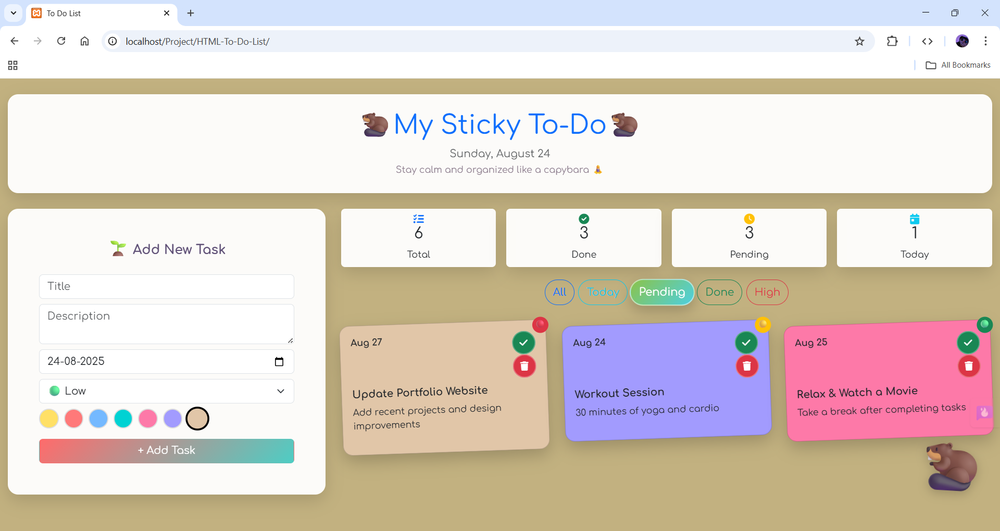
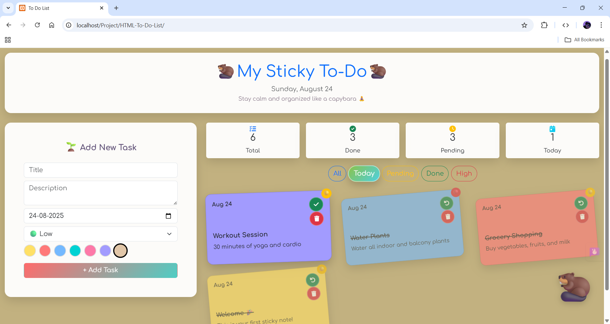
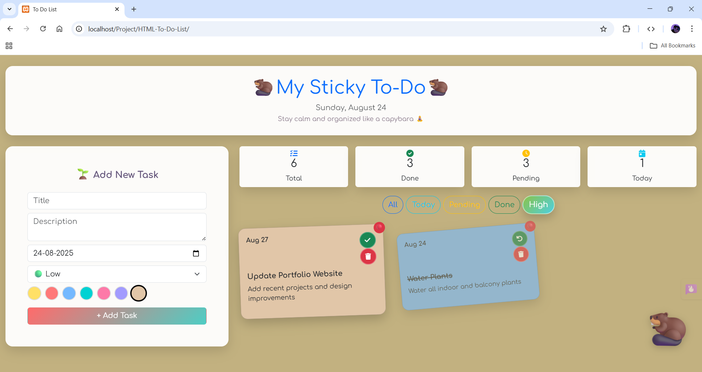
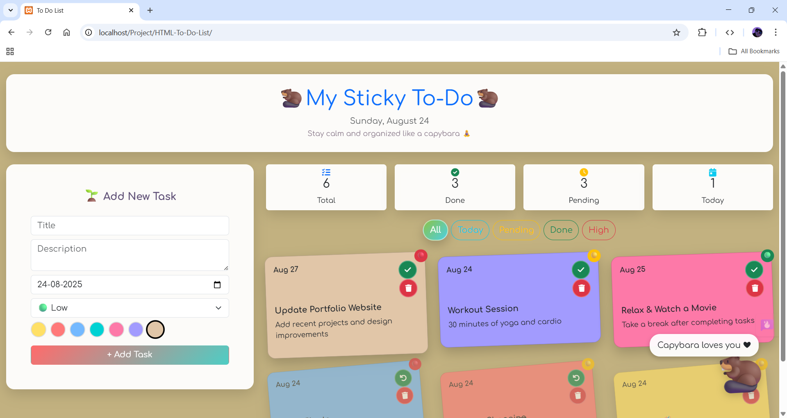

# My Sticky To-Do

A **dynamic To-Do List** application built using **HTML, CSS, and JavaScript**, allowing users to add, complete, delete, and filter tasks with priority and due date, along with a fun interactive capybara companion.  

---

## 🚀 Features
- Add new tasks with title, description, due date, and priority  
- Mark tasks as completed  
- Delete tasks  
- Filter tasks by status (All, Today, Pending, Completed) and priority (High)  
- View task statistics: total, completed, pending, and today's tasks  
- Interactive floating capybara with motivational messages  
- Responsive and user-friendly interface  

---

## 🛠️ Technologies Used
- **Frontend:** HTML, CSS, JavaScript  
- **Libraries:** Bootstrap 5, Font Awesome 6  
- **Version Control:** Git & GitHub  

---

## 📸 Screenshots

### 1. Home Screen

### 2. Adding Task

### 3. Completed Tasks

### 4. Pending Tasks

### 5. Filtering Tasks

### 6. High Priority Tasks

### 7. Interactive Capybara

---

## 🔗 Live Demo
[View Live Project](https://tanushrisv.github.io/HTML-TO-DO-LIST/)

© 2025 Tanushri S V. All rights reserved.
